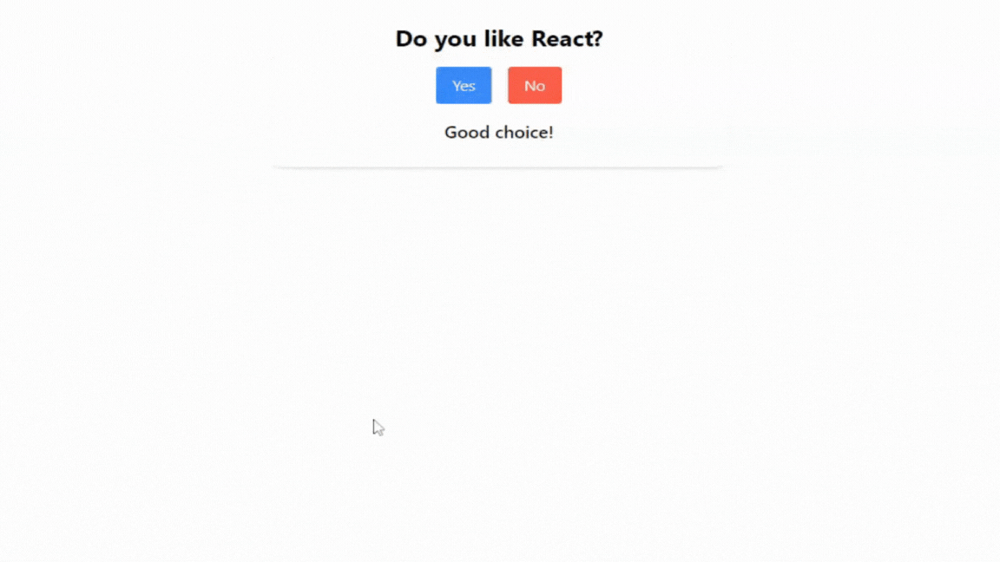
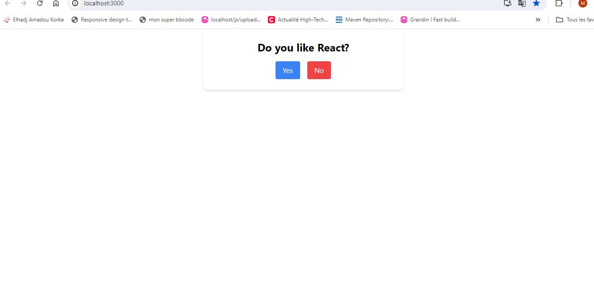
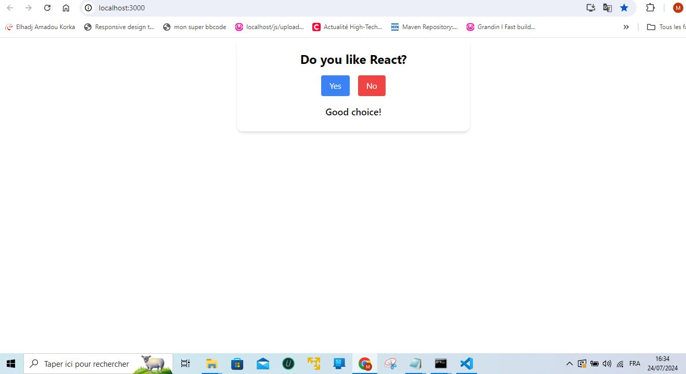

# technical-exo

## Description

This is a simple Q&A game built with React and TypeScript. The game loads a question and two possible answers from a JSON file. Users can select their answer and see a response. The project uses Tailwind CSS for styling and Framer Motion for animations to enhance the user experience.

## Features

- Loads question and answers from a JSON file
- Displays a question with "Yes" and "No" buttons
- Shows a corresponding response based on user input
- Buttons remain visible after selection
- Uses Tailwind CSS for modern styling
- Implements animations with Framer Motion

## Demo





## Table of Contents

- [Installation](#installation)
- [Usage](#usage)
- [Development](#development)
- [Technologies](#technologies)

## Installation

1. **Clone the repository:**

   ```bash
   git clone https://github.com/yourusername/technical-exo.git
   cd technical-exo
2. **Install the dependencies:**
    ```bash
    npm install
3. **Set up Tailwind CSS:**
    - Tailwind CSS is already included and configured in the project. No additional setup is required.

## Usage

1. **Start the development server:**
     ```bash
     npm start
2. **Open your browser and navigate:**
    ```bash
    http://localhost:3000
3. **Interact with the game:**
    -You will see a question and two buttons. Click on "Yes" or "No" to see the corresponding response.

## Developement


###  `Styling`
Tailwind CSS classes are used for styling. You can customize styles in the index.css file or directly in your components.


###  `Animations`
Framer Motion is used for animations. You can customize or add more animations in the Question.tsx component.

## Technologies
 - React
 - TypeScript
 - Tailwind CSS
 - Framer Motion


